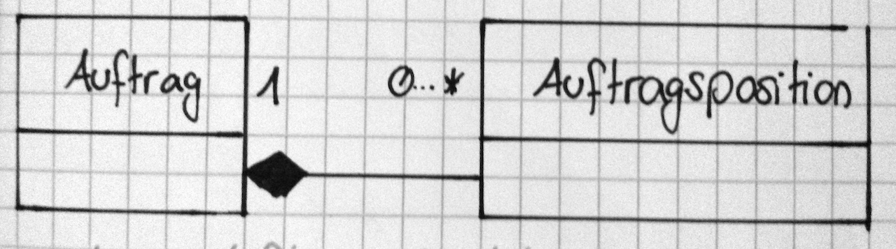
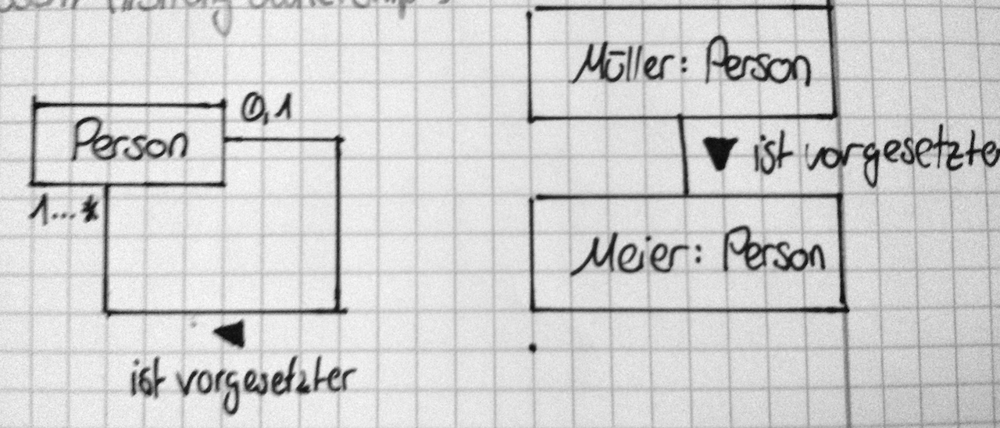

# Systemanalyse & -entwurf
_Semester 1, WWI13b, DHBW Lörrach_

---

## Allgemein

Oft entstehen in Projekten Probleme durch Fehler, die schon früh gemacht wurden

Das __Software Engineering__ ist das ingenieursmäßige Entwickeln, Anpassen und Warten von Software. Um das Qualitätsniveau hoch halten zu können, ist eine Erfassung und Erfüllung von Anforderungen sowie ein systematisch korrektes Vorgehen wichtig.

 _Ziel: Mehr Planungsaufwand, weniger Realisierungs- und Wartungsaufwand_

## Modelle

 Ein __Modell__ ist eine vereinfachte Darstellung der Sache (z.B. Hausbauplan o. Landkarte), die von einem gewissen Ziel geprägt ist.

 __Modelle für Software:__ Spezifikationen, UML-Diagramme

 __Modelle für Prozesse:__ EPK, (BPMN)

 ### Vorgehensweisen bei der Modellerstellung

 Bei der __Abstraktion__ wird verallgemeinert: Details werden (vorerst) ausgelasen und später hinzugefügt

 Bei der __Projektion__ wird versucht, das Projekt aus jeder Sichtweise zu betrachten. _Das ist sehr schwer!_

 Bei der __Zerlegung__ wird ein Problem in kleine Module zerlegt, die einzeln abgehandelt werden

## Anforderungen

 __Anforderungen__ legen fest, was ein System können soll, nicht jedoch wie es realisiert wird.

 Eine __funktionale Anforderung__ legt fest, wie ein Programm funktionieren soll _(Was tut ein Programm? Wie reagiert es auf x? Welche Schnittstellen hat es?)_

 Eine __nichtfunktionale Anforderung__ gibt Rahmenbedingungen oder einschränkende Bedingungen vor.

 Ein häufig auftretendes Problem ist, dass der Kunde nicht weiß, was er möchte bzw. es nicht richtig ausdrücken kann. Hier muss verstanden werden, was der Kunde (und seine Mitarbeiter) möchte.

 Die _Formulierung von Anforderungen_ erweist sich als schwierig. Wichtig hierbei ist eine klare Struktur, vollständigkeit, Widerspruchsfreiheit, Verständlichkeit, sowie Knappheit und Klarheit.

 _Informationen_ können entweder personenbezogen durch Interviews, Fragebögen oder Beobachtung gewonnen werden. Eine andere Art der Informationsgewinnung ist die Dokumentenbezogene.

## Das ARIS-Haus

 

 Jedes der Elemente besteht aus 3 Beschreibungsebenen:

 - Fachkonzept

 - techn. Konzept

 - Implementierung

## EPK

 

 __Regeln:__

 - Eine EPK beginnt und endet mit einem Ereignis

 - Funktionen und Ereignisse müssen sich abwechseln

 - Verbindungen mit Pfeilen

 - Nur Funktionen dürfen Entscheidungen fällen (or || xor)

 - Eine Trennung (and, or, xor) muss auf die selbe Weise wieder zusammengeführt werden

 - Ereignisse und Funktionen haben jeweils nur 1 Eingang und 1 Ausgang

 - Beschriftung nacht dem Muster _[substantiv] [Zustand / Aktion]_

 	- z.B. _"Beleg liegt vor"_ oder _"Bestellung aufgegeben"_

## Entscheidungstabelle 

## Entscheidungsbaum

## Objektorientierung

Bei der __Objektorientierung__ wird logisch Zusammengehöriges zusammengefasst.

Objekte kommunizieren über Schnittstellen miteinander.

Sie bringen viel Struktur in ien Projekt, sind wartungsfreundlicher und erhöhen die Wiederverwendbarkeit des Codes

Ein Objekt besteht aus _Attributen_ (Variablen) und _Operatoren_ (Funktionen), die nach dem "Bauplan" einer Klasse gebaut werden. Der Zustand eines Objektes wird über die Werte seiner Attribute zu einem bestimmten Zeitpunkt bestimmt.

#### Kapselung

Jedes Objekt ist nach außen nur durch seine Schnittstelle sichtbar. Die Daten eines Objektes sind von außen nicht direkt sichtbar

#### Polymorphie

Die Implementierung innerhalb eines Objektes ist nach außen hin völlig egal. Verschiedene Objekte können die selbe Methode verschieden Implementieren.

## UML-Klassendiagram

#### Klasse:

- Es werden nur nach außensichtbare Operationen angegeben (Schnittstelle)

- Unwichtiges (z.B. getter & setter) können weg gelassen werden

#### Objekt:

#### Vererbung:

#### Assoziation:

_"1 Kunde hat kein oder mehrere Konten, 1 Konto hat genau einen Besitzer"_

#### Komposition

Wird ein Auftragsobjekt gelöscht, werden auch seine Positionen gelöscht (_"Strong ownership"_)

#### Beispiel: Vererbung in Klassen- & Objektdiagram

## Sequenzdiagram

## Aktivitätsdiagram

- Aktivitäten können durch Swimlanes verschiedene Zuständigkeiten zugewiesen werden

## Zustandsdiagram

Zeigt, welche Zustände ein Objekt einnehmen kann und mit welcher Operation zwischen ihnen gewechselt wird

## Use cases

Usecasediagramme zeigen nur eine grobe Struktur, sie sind alleine aber nur wenig aussagekräftig. Meist wird zusätzlich ein genauer spezifizierter Use Case geliefert.

#### Use Case:

<table>
	<tr>
		<td>Name</td>
		<td>...</td>
	</tr>
		<tr>
		<td>Kurzbeschreibung</td>
		<td>...</td>
	</tr>
		<tr>
		<td>Akteure</td>
		<td>...</td>
	</tr>
		<tr>
		<td>Auslöser</td>
		<td>...</td>
	</tr>
		<tr>
		<td>Ergebnis</td>
		<td>...</td>
	</tr>
		<tr>
		<td>Bedingung</td>
		<td>...</td>
	</tr>
</table>

Use cases sollten folgende Bedingungen erfüllen:

- für Auftraggeber verständlich

- kurz & klar

- Sonderfälle vom Standard trennen
