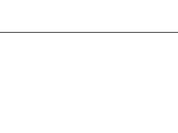
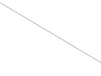
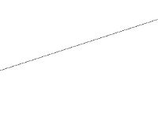
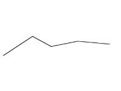

# Kosten- & Leistungsrechnung
_Semester 1, WWI13b, DHBW Lörrach_
__unvollständig__

---

- __Controller:__ Unterstützt den Manager, schaut das alles im Rahmen läuft

	- Ziele: Wirtschaftlichkeit steigern

	- Informationsfluss organisieren

	- Daten so Zusammenfassen, dass andere Anhand der Daten entscheiden können

- __Controlling:__ Zusammenspiel zw. Manager & Controller

	- Abweichungen feststellen und korrigieren

- __Auszahlung / Einzahlung:__ Δ liq. Mittel

- __Ausgabe / Einnahme:__ Δ liq.Mittel + ΔForderungen - ΔVerbindlichkeiten

- __Aufwendung:__ Verbrauchte Güter & Diensleistungen

- __Ertrag:__ Erstellte Güter & Dienstleistungen

- __Nutzungsintensität:__ Kosten pro Zeit / sonst. Maßeinheit

- __Grenzkosten:__ Kosten, die durch die Produktion eines weiteren Produkt entstehen würden (Steigung der Ableitung im Punkt x)

- __Durchschnittskosten:__ Kosten / Stück bei gewünschter Produktion


## Materialkosten bei schwankenden Preisen

```
             500 Stück zu 15€/Stück
Kauf       + 200 Stück zu 20€/Stück
Verbrauch  - 300 Stück zu ??€/Stück
```

#### Durchschnittskostenmethode

Es wird der Durchschnittsstückpreis zur Kalkulation genutzt. (In diesem Beispiel `300 Stück zu 16.43€/Stück`)

#### LiFo (_"Last in, First out"_)

_"Last in, First out"_ - wie im Stack: Die als letztes gekauften Einheiten gehen als erstes wieder raus.

In diesem Beispiel:
```
     200 Stück zu 20€/Stück
und  100 Stück zu 15€/Stück
```


## Abschreibungsverfahren

#### lineare Abschreibung



Jedes Jahr wird der selbe Betrag abgeschrieben


#### arithmetisch degressiv



Jedes Jahr wird x€ weniger abgeschrieben


#### geometrisch degressiv


Jedes Jahr werden x% des Restwertes abgeschrieben


#### arithmetisch progressiv



Jedes Jahr wird x€ mehr abgeschrieben


#### mengenorientiert



Abgeschreibung orientiert sich an dem (erwarteten Verbrauch)